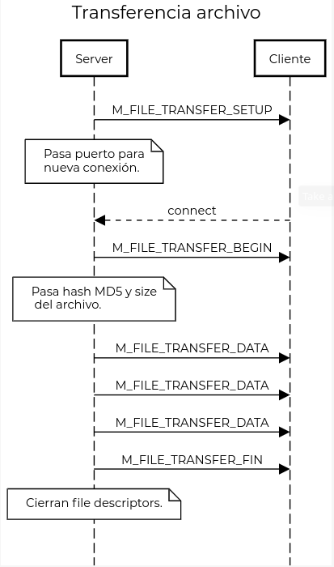

# TP 1

## Instalación

1. Tener instalado openssl.
2. Correr el comando `sudo make`, para compilar los programas y cambiar `somaxconn`, el número 
máximo para la cola de `listen()`.

## Diseño

- Se eligió trabajar con TCP porque hace una gran parte del trabajo, asegura que los paquetes 
llegan en orden, corrección de errores, etc.

### Conexión Servidor - Clientes

1. El suscriptor hace el connect al servidor.
2. El servidor pollea un socket que esta escuchando, y acepta la request.
3. Inmediatamente después el servidor le avisa que fue aceptado enviándole un token
identificatorio.
4. El servidor agrega un nodo a una lista enlazada guardando los siguientes datos
de la conexión/sesión.
  * `timestamp` - es la última vez que el cliente ACKEO un mensaje de su suscripción.
  * `susc_counter` - es el contador de suscripciones, sirve para decidir si cerrarle la
  conexión o no al cliente, ya que si está suscripto y no responde los mensajes, hay que
  echarlo por inactivo, y si no está suscripto a nadie, no tiene nada que responder asi
  que no hay que echarlo.
  * `sockfd` - socket por el cual el server puede comunicarse con el cliente.
  * `token` - campo identificatorio. 

### Reconexión

- Se optó por un simple esquema de autenticación, en el que el servidor le entrega un token
al cliente para que se identifique con el mismo, en vez de identificarse con ip/puerto.
- El token es de 32 bits, vulnerable a ataques de cumpleaños.
- El esquema es el siguiente:

### Comunicación DM - Productores

- Se usó una cola de mensajes POSIX, porque se puede manejar como un file descriptor
más, y si bien la cola de mensajes de SystemV tiene prioridades, no son necesarias
en esta aplicación.

### Comunicación DM - CLI

- Se optó por hacer un binario a parte para la CLI, siguiendo el esquema de la consigna.
- Para comunicarlos se usó una named pipe o FIFO, ya que son procesos no emparentados.

### Envío del log

- Se usó la librería del siguiente enlace https://github.com/kuba--/zip para 
realizar la compresión.
- En vista de que en caso de ser monohilo y recibir muchas request del log, la performance
podría verse comprometida, se optó por hacer la transferencia del archivo en paralelo.
- La recepción del archivo también se hace en paralelo para poder seguir recibiendo los 
mensajes de los productores.
- El esquema es el siguiente

- Finalmente el cliente chequea el hash del archivo recibido con el del servidor.

